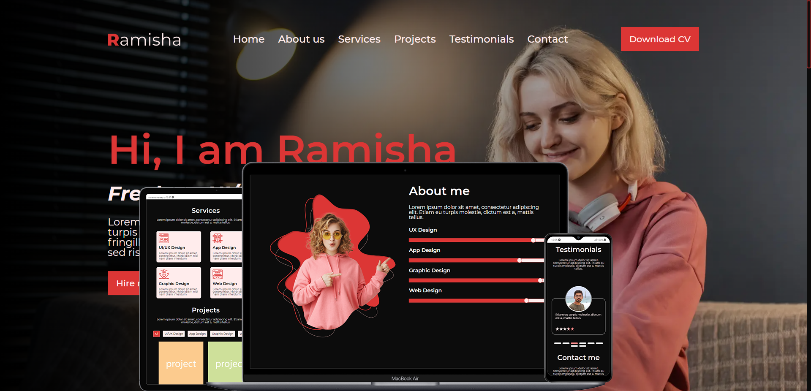

    <h1>Mumair</h1>
    
Простий лендінг створений 17.04.2024

    </img>
    

        
        
        
        
        
        
        
        
        
        
        
        
        
        
        
        
        
    

